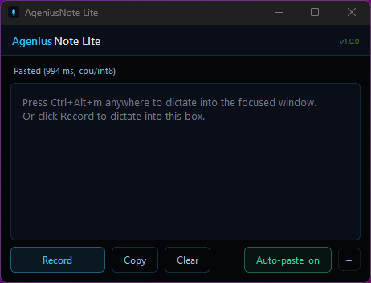

# AgeniusNote Lite

Tiny, fast, offline voice-to-text for Windows and macOS. Press a hotkey, talk, your words get pasted into whatever window you were working in. No cloud, no account, no wake word, no LLM parsing. Just `faster-whisper` doing pure speech-to-text on your machine.

Made by [Agenius AI Labs](https://ageniusailabs.com).



## Install

Grab the latest release from the [Releases](https://github.com/Agenius-AI-Labs/ageniusnote-lite/releases) page.

### Windows

1. Download `AgeniusNoteLite-Setup-x.y.z.exe`.
2. Run the installer. Default install path is `%LocalAppData%\Programs\AgeniusNote Lite`.
3. Optional during setup: tick "Create a desktop icon" and "Launch when Windows starts".
4. Launch AgeniusNote Lite. The window stays on top so you can see the recording state.

### macOS

1. Download the DMG for your Mac:
   - **Apple Silicon (M1/M2/M3/M4):** `AgeniusNoteLite-Setup-x.y.z-arm64.dmg`
   - **Intel:** see [CHANGELOG.md](CHANGELOG.md) under v1.0.1 "Known limitations". The Intel build path is wired and ready; the DMG will be attached to the v1.0.1 release page as soon as a GitHub Actions Intel runner becomes available. If you need Intel sooner, build from source (see below) or file an issue.
2. Open the DMG, drag `AgeniusNote Lite.app` into `Applications`.
3. **First launch:** notarized releases (v1.0.4+) open with a normal double-click. (Older, un-notarized builds were blocked by Gatekeeper; if you hit that on an older DMG, right-click → Open the first time, or run `xattr -dr com.apple.quarantine "/Applications/AgeniusNote Lite.app"`.)
4. macOS permissions — what you need and when:
   - **Microphone:** always required (you're dictating). Granted on first recording.
   - **Accessibility:** **only needed if you want auto-paste.** Without it, transcribed text still lands on your clipboard and you press ⌘V to insert; with it, AgeniusNote Lite types the text into the focused window after transcription. AgeniusNote Lite prompts once and can open the right Settings pane for you. Grant under System Settings → Privacy & Security → Accessibility.
   - **Input Monitoring:** not required for the keyboard hotkey as of v1.0.4 — it uses Carbon `RegisterEventHotKey`, which dispatches through the OS without this permission. (The *optional* mouse-button trigger does use a low-level listener; if you bind a mouse button on macOS you may be prompted for Input Monitoring / Accessibility for that feature.)

   The app reads no data; macOS just requires explicit permission for simulated paste, the microphone, and global mouse listening.

First-run note: faster-whisper downloads the `base.en` model (~150 MB) on the first transcription. After that it works fully offline.

## Use it

| Action | Result |
|---|---|
| Press **Ctrl+Alt+M** while focused on VSCode, Cursor, your terminal, a browser, anything | Recording starts. The window pulses red. |
| Press **Ctrl+Alt+M** again | Recording stops and transcribes. Windows auto-pastes immediately; on macOS, auto-paste works when Accessibility is granted, otherwise the text is copied and you paste manually. |
| Click **Record** in the lite window | Records into the lite window's notepad (no auto-paste). |
| **Auto-paste on/off** | Only affects hotkey sessions. Off = clipboard only, you paste manually. |
| **Copy** / **Clear** | Standard. The clipboard is also set automatically on every transcription. |

## Configure

The easiest way is the in-app **Settings** menu (the gear button): program the keyboard shortcut and mouse button by pressing them, pick the mouse mode, model, and device, and it persists across launches. The environment variables below are the equivalent knobs for power users and scripted setups; a saved setting takes precedence over the matching env var.

All env knobs are read at launch.

| Variable | Default | Purpose |
|---|---|---|
| `VN_LITE_MODEL` | `base.en` | Any faster-whisper model name. `tiny.en` (fastest), `base.en` (default), `small.en`, `medium.en`, `large-v3` (slowest, best). |
| `VN_LITE_HOTKEY` | `<ctrl>+<alt>+m` | Hotkey combo. Windows/Linux: pynput strings (`<f9>`, `<alt_r>+v`, `<ctrl>+<shift>+;`). macOS: same syntax, parsed by the built-in Carbon binding (`<ctrl>+<alt>+m`, `<cmd>+<shift>+m`, `f8`, etc.). |
| `VN_LITE_DEVICE` | `cpu` | Device strategy: `cpu` (small installer, default), `cuda` (NVIDIA GPU if CUDA libs exist), or `auto` (try CUDA then CPU). |
| `VN_LITE_MOUSE_BUTTON` | _(off)_ | Optional mouse-button trigger. One of `x1`/`back`, `x2`/`forward`, `middle`. Side buttons are the natural choice since they don't collide with normal clicking. Unset means no mouse trigger. Note: the OS only exposes these five buttons; extra buttons on a multi-button gaming mouse are handled by the vendor driver and aren't visible to the app. To use one, map it to a keyboard shortcut in your mouse software (G HUB, Synapse, iCUE, etc.) and set that as `VN_LITE_HOTKEY` instead. |
| `VN_LITE_MOUSE_MODE` | `toggle` | How the mouse button behaves: `toggle` (click to start, click again to stop, like the keyboard hotkey) or `hold` (push-to-talk: hold to record, release to transcribe). |
| `VN_LITE_MOUSE_SUPPRESS` | `1` (on) | When a mouse button is bound, block its normal action so the forward/back side buttons don't also navigate the browser. Set `0` to leave the button's default behavior intact. Only the bound button is affected. |

Set them via the Windows env-var dialog or in a wrapper `.cmd` file.

## If the hotkey doesn't fire

Far and away the most common issue. Symptom: you press the hotkey and the Lite window doesn't pulse, nothing happens. The cause is almost always **hotkey collision**, another app installed a global binding on the same chord first and is consuming the keystroke before Lite's listener sees it. Common culprits on Windows include VS Code (and its AI-chat extensions like Codex, Copilot, Cursor), Discord push-to-talk, Steam overlay, OBS, and various productivity launchers. On macOS, Spotlight, Raycast, Alfred, and built-in accessibility shortcuts will all happily eat a chord.

Quick fix: change `VN_LITE_HOTKEY` to something less contested. `<f9>` is almost always safe, as are `<ctrl>+<shift>+;` and `<alt_r>+v`. Set it as a user env var and relaunch Lite, no rebuild needed. If you want to keep `Ctrl+Alt+M`, open the offending app's keybindings UI and unbind it there instead, the change to whichever app you go through propagates immediately.

macOS specifics: the v1.0.4+ Carbon hotkey does *not* need Accessibility or Input Monitoring permissions to fire. If it doesn't trigger, it's almost certainly a collision with another app or a non-ASCII letter your keyboard layout doesn't expose at that virtual keycode. Try `f8`, `<cmd>+<shift>+m`, or `<ctrl>+<alt>+\` first.

## How it works

- Audio capture: `sounddevice` (PortAudio) records 16 kHz mono in a background thread.
- Speech-to-text: `faster-whisper` with VAD on. Defaults to CPU int8 for reliability and small installer size. Set `VN_LITE_DEVICE=cuda` to opt into GPU; if CUDA load fails at runtime, Lite retries once on CPU.
- Hotkey: Windows/Linux use `pynput`'s low-level keyboard hook. macOS uses Carbon `RegisterEventHotKey` directly (via ctypes), the same API native Mac apps like Slack and iTerm use — no Accessibility permission needed, and it survives ad-hoc code signatures that break TCC permission persistence. Hotkey toggle does NOT activate the lite window so your previous focus is preserved.
- Paste: clipboard is always set. Windows then restores the original foreground HWND via the AttachThreadInput trick and sends `Ctrl+V`. macOS posts `Cmd+V` via `CGEventPost` (CoreGraphics) — cross-app delivery requires Accessibility; without it, the clipboard is still populated and you ⌘V manually.

No data leaves your machine.

## Build from source

Requires Python 3.11+.

```bash
git clone https://github.com/Agenius-AI-Labs/ageniusnote-lite.git
cd ageniusnote-lite
pip install -r requirements.txt

# Dev run (no installer)
python voice_notes_lite.py
```

### Build Windows installer

Requires [Inno Setup 6](https://jrsoftware.org/isdl.php).

```powershell
./packaging/build.ps1
# Output: dist-build-<stamp>/installer/AgeniusNoteLite-Setup-<version>.exe
```

### Build macOS .dmg

Requires Xcode command-line tools and (optionally) `create-dmg`:

```bash
brew install create-dmg   # optional; hdiutil fallback if missing
./packaging/build.sh
# Output: dist-build-mac-<stamp>/AgeniusNoteLite-Setup-<version>-<arch>.dmg
# arch defaults to the host's architecture (arm64 on Apple Silicon, x86_64 on Intel).
# Set ARCH=arm64 or ARCH=x86_64 to override the label.
```

The packaging spec excludes PyTorch, transformers, and other heavy deps that aren't actually used (faster-whisper runs on CTranslate2). Final installer is ~100 MB.

## Project docs

- [CHANGELOG.md](CHANGELOG.md) — version history.
- [ROADMAP.md](ROADMAP.md) — what's planned for v1.1 and beyond (local TTS via Supertonic).
- [CONTRIBUTING.md](CONTRIBUTING.md) — how to file issues and send patches.
- [SECURITY.md](SECURITY.md) — how to report security issues privately.

## License

MIT. See [LICENSE](LICENSE).

## Credits

- [faster-whisper](https://github.com/SYSTRAN/faster-whisper), CTranslate2-based Whisper inference.
- [PySide6](https://wiki.qt.io/Qt_for_Python), Qt for Python.
- [pynput](https://github.com/moses-palmer/pynput), cross-platform input control.
- [sounddevice](https://python-sounddevice.readthedocs.io/) / [soundfile](https://python-soundfile.readthedocs.io/), audio I/O.
